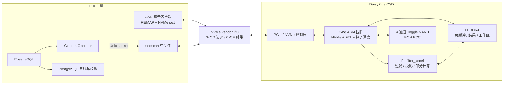

# DMO

> 面向 DaisyPlus / Cosmos+ OpenSSD 平台的数据库算子近数据计算原型

DMO 是一个软硬件协同的计算存储设备（Computational Storage Device，CSD）项目。它将 PostgreSQL 物理页解析、谓词过滤以及部分关系算子下推到 SSD 内部执行，使主机只需发送表结构、谓词/算子描述和数据物理区间，并接收命中元组或紧凑的计算结果。

项目基于 Zynq UltraScale+ MPSoC 和 DaisyPlus OpenSSD 硬件，将 Linux 主机、PostgreSQL、自定义 NVMe 命令、ARM 侧 FTL/算子运行时、PL 侧 FPGA 加速器以及多通道 NAND 控制器贯通起来。当前实现覆盖过滤扫描、投影、聚合、有界 Top-K 和两阶段 Hash Join，主要用于研究和验证数据库算子下推、ARM/FPGA 异构执行及主机—存储数据移动优化。

## 项目目标

- **减少数据搬移**：在数据所在设备内完成筛选、投影、聚合和哈希连接，仅向主机返回需要的结果。
- **支持异构执行**：由 Zynq ARM 核执行完整语义，并在适合的路径上调用 FPGA 加速器；
- **打通完整数据链路**：从 PostgreSQL 关系文件的物理区间，到 NVMe vendor command、FTL、NAND 读取和结果 DMA，提供可研究的端到端实现。
- **便于正确性与性能对照**：主机工具同时提供 PostgreSQL 基线、CSD 基准、统一结果解码和 canonical checksum。
- **保留 OpenSSD 能力**：在现有 NVMe、地址转换、请求调度、数据缓冲、垃圾回收和 NAND/ECC 数据通路上扩展计算功能。


## 系统架构



## 支持的算子

| 算子        | 当前能力                                                     | 对外执行模式              | 结果形式                        |
| ----------- | ------------------------------------------------------------ | ------------------------- | ------------------------------- |
| Filter Scan | 解析 PostgreSQL 8 KiB heap page，执行数值、日期和字符串谓词及逻辑组合 | ARM / FPGA                | 命中位置、计数或重组后的结果页  |
| Projection  | 在过滤结果上选择最多 16 个属性，处理定长值、NULL 及受支持的 varlena | `arm` / `fpga`            | Compact V1 行格式               |
| Aggregate   | 最多 8 个 `SUM`、`MIN`、`MAX` 操作，合并分批/分页部分结果    | `arm` / `fpga` / `auto`   | 聚合值、非空计数及溢出/NaN 状态 |
| Top-K       | 按单个键执行有界排序，支持升/降序及 NULL 顺序                | `arm` / `auto`            | 排序键和原始元组候选            |
| Hash Join   | 按 session 执行 BUILD/PROBE 两阶段连接，维护持久 ARM 哈希表  | `arm` / `hybrid` / `auto` | 匹配计数或 build/probe 元组对   |

算子 ABI 定义的基础值类型包括 `int4`、`int8`、`float8` 和字节串，具体可用类型取决于算子和执行路径。FPGA 聚合要求操作集合满足同列、同类型等兼容条件；

当前固件支持最多 64 个 PostgreSQL 页组成一个 FPGA batch，并在 LPDDR4 中预留结果区、投影/聚合 partial/Join hash 共享 staging 区，以及 Compute 和 Join 工作区。遇到不支持的数据布局、配置或硬件错误时，固件会设置明确的错误/回退标志，便于主机判断实际执行路径。


## 硬件与软件组成

| 层次          | 当前实现                                                     |
| ------------- | ------------------------------------------------------------ |
| FPGA/SoC      | AMD/Xilinx Zynq UltraScale+ `xczu17eg-ffvc1760-2-e`          |
| FPGA 工具     | Vivado 2025.1；工程入口为 `cosm-plus-sys.xpr`                |
| 外部内存      | PS 侧 32-bit LPDDR4，工程配置为 LPDDR4-2133                  |
| NAND 数据通路 | 4 个 Toggle NAND controller、4 个通道 helper、4 路 BCH SC/CS 和共享 KES |
| 主机接口      | PCIe/NVMe controller，自定义 I/O opcode `0xCD`、`0xCE`、`0xCF` |
| ARM 固件      | Cosmos+ 风格裸机 FTL，包含映射、缓冲、调度、GC、NVMe 和算子运行时 |
| FPGA 算子     | AXI4-Lite 控制 + AXI4 master 数据访问的 `filter_accel`       |
| 主机环境      | Linux；依赖 FIEMAP、NVMe passthrough，PostgreSQL 对照程序依赖 `libpq` |

## 仓库结构

```text
.
├── cosm-plus-sys.xpr                  # Vivado 2025.1 工程入口
├── cosm-plus-sys.srcs/
│   ├── sources_1/bd/sys_top/          # 系统 Block Design 与 IP 实例配置
│   ├── impl_1/new/                    # NAND、NVMe、时钟和引脚约束
│   └── utils_1/imports/new/           # 实现阶段 Tcl hook
├── cosm-plus-sys.ipdefs/ip-repo_0_0/  # NVMe、NAND、ECC、IODELAY、filter_accel 等本地 IP
├── operators/
│   ├── host/                          # Linux 客户端、benchmark、结果解码与 checksum
│   ├── rtl/                           # 扩展版 filter_accel RTL 与 SystemVerilog testbench
│   └── ws2/ftl/run-gr3ftl/src/        # ARM 裸机固件、FTL、NVMe 扩展和算子 ABI
├── postgresql/                        # PostgreSQL 
├── LICENSE                            # 项目主许可证 GPL-3.0
└── README.md
```

### 关键入口

| 关注内容                    | 文件/目录                                                    |
| --------------------------- | ------------------------------------------------------------ |
| Vivado 工程                 | `cosm-plus-sys.xpr`                                          |
| 系统 Block Design           | `cosm-plus-sys.srcs/sources_1/bd/sys_top/sys_top.bd`         |
| Vivado 当前封装的加速器 RTL | `cosm-plus-sys.ipdefs/ip-repo_0_0/filter_accel/src/filter_accel.v` |
| 扩展版加速器开发 RTL        | `operators/rtl/filter_accel_src/filter_accel.v`              |
| RTL 验证                    | `operators/rtl/tb/filter_accel_projection_tb.sv`             |
| 固件入口与配置              | `operators/ws2/ftl/run-gr3ftl/src/main.c`、`filter_config.h`、`ftl_config.h` |
| NVMe CSD 命令处理           | `operators/ws2/ftl/run-gr3ftl/src/nvme/nvme_io_cmd.c`        |
| Projection/Compute/Join ABI | `operators/ws2/ftl/run-gr3ftl/src/nvme/filter_*_abi.h`       |
| 主机 NVMe/FIEMAP 层         | `operators/host/csd_operator_io.c`                           |


## 许可证与来源

项目主许可证见 `LICENSE`（GNU GPL v3）。
本项目建立在 Cosmos+ / DaisyPlus OpenSSD、PostgreSQL 以及 AMD/Xilinx FPGA 工具链与 IP 生态之上。