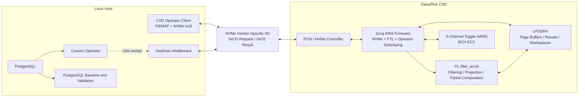

# DMO

[简体中文](README.md) | **English**

> A near-data processing prototype for database operators on the DaisyPlus / Cosmos+ OpenSSD platform

DMO is a Computational Storage Device (CSD) project built through hardware/software co-design. It offloads PostgreSQL physical-page parsing, predicate filtering, and selected relational operators into the SSD. The host only needs to send the table schema, predicate/operator descriptors, and physical data extents and receive matching tuples or compact computation results.

Built around a Zynq UltraScale+ MPSoC on DaisyPlus OpenSSD hardware, the project connects a Linux host, PostgreSQL, vendor-specific NVMe commands, an ARM-side FTL and operator runtime, a PL-side FPGA accelerator, and multi-channel NAND controllers. The current implementation covers filter scan, projection, aggregation, bounded Top-K, and two-phase hash join. It is primarily intended for research and validation of database operator pushdown, heterogeneous ARM/FPGA execution, and optimization of data movement between the host and storage device.

## Project Goals

- **Reduce data movement**: Perform filtering, projection, aggregation, and hash join where the data resides, returning only the required results to the host.
- **Support heterogeneous execution**: Execute full operator semantics on the Zynq ARM cores and invoke the FPGA accelerator on suitable execution paths.
- **Provide an end-to-end data path**: Provide a research-ready implementation spanning PostgreSQL relation-file extents, vendor-specific NVMe commands, the FTL, NAND reads, and result DMA transfers.
- **Enable correctness and performance comparisons**: Provide a PostgreSQL baseline, CSD benchmarks, unified result decoding, and canonical checksums in the host tools.
- **Preserve OpenSSD capabilities**: Extend the existing NVMe, address-translation, request-scheduling, data-buffering, garbage-collection, and NAND/ECC data paths with computational functionality.

## System Architecture



## Supported Operators

| Operator | Current Capabilities | Execution Modes | Result Format |
| --- | --- | --- | --- |
| Filter Scan | Parses PostgreSQL 8 KiB heap pages and evaluates numeric, date, and string predicates with logical combinations | ARM / FPGA | Matching tuple positions, counts, or reconstructed result pages |
| Projection | Selects up to 16 attributes from filtered results and handles fixed-length values, `NULL`, and supported `varlena` values | `arm` / `fpga` | Compact V1 row format |
| Aggregate | Executes up to eight `SUM`, `MIN`, and `MAX` operations and merges partial results across batches and pages | `arm` / `fpga` / `auto` | Aggregate values, non-`NULL` counts, and overflow/NaN status |
| Top-K | Performs a bounded sort on a single key with support for ascending/descending order and `NULL` ordering | `arm` / `auto` | Sort keys and original tuple candidates |
| Hash Join | Performs session-based, two-phase BUILD/PROBE joins using a persistent ARM-side hash table | `arm` / `hybrid` / `auto` | Match counts or build/probe tuple pairs |

The operator ABI defines the basic value types `int4`, `int8`, `float8`, and byte strings. The types available in practice depend on the operator and execution path. FPGA aggregation requires a compatible operation set, including constraints such as operating on the same column and data type.

The current firmware supports FPGA batches of up to 64 PostgreSQL pages. The LPDDR4 address space includes a reserved result region, a shared staging region for projection data, aggregation partial results, and join hash data, as well as separate Compute and Join workspaces. When the firmware encounters an unsupported data layout or configuration, or a hardware error, it sets explicit error or fallback flags so that the host can identify the effective execution path.

## Hardware and Software Components

| Layer | Current Implementation |
| --- | --- |
| FPGA/SoC | AMD/Xilinx Zynq UltraScale+ `xczu17eg-ffvc1760-2-e` |
| FPGA Toolchain | Vivado 2025.1; the project entry point is `cosm-plus-sys.xpr` |
| External Memory | 32-bit PS-side LPDDR4 configured as LPDDR4-2133 |
| NAND Data Path | 4 Toggle NAND controllers, 4 channel helpers, 4 BCH SC/CS paths, and a shared KES |
| Host Interface | PCIe/NVMe controller with vendor-specific I/O opcodes `0xCD`, `0xCE`, and `0xCF` |
| ARM Firmware | A Cosmos+-style bare-metal FTL with mapping, buffering, scheduling, GC, NVMe, and an operator runtime |
| FPGA Operator Engine | `filter_accel` with an AXI4-Lite control interface and an AXI4 master data-access interface |
| Host Environment | Linux; requires FIEMAP and NVMe passthrough; the PostgreSQL comparison program requires `libpq` |

## Repository Structure

```text
.
├── cosm-plus-sys.xpr                  # Vivado 2025.1 project entry point
├── cosm-plus-sys.srcs/
│   ├── sources_1/bd/sys_top/          # System block design and IP instance configuration
│   ├── impl_1/new/                    # NAND, NVMe, clock, and pin constraints
│   └── utils_1/imports/new/           # Implementation-stage Tcl hooks
├── cosm-plus-sys.ipdefs/ip-repo_0_0/  # Local NVMe, NAND, ECC, IODELAY, and filter_accel IP
├── operators/
│   ├── host/                          # Linux clients, benchmarks, result decoding, and checksums
│   ├── rtl/                           # Extended filter_accel RTL and SystemVerilog testbench
│   └── ws2/ftl/run-gr3ftl/src/        # ARM bare-metal firmware, FTL, NVMe extensions, and operator ABI
├── postgresql/                        # PostgreSQL
├── LICENSE                            # Primary project license: GPL-3.0
├── README.md                          # Chinese documentation
└── README_EN.md                       # English documentation
```

### Key Entry Points

| Area | File/Directory |
| --- | --- |
| Vivado Project | `cosm-plus-sys.xpr` |
| System Block Design | `cosm-plus-sys.srcs/sources_1/bd/sys_top/sys_top.bd` |
| Accelerator RTL Currently Packaged in the Vivado Project | `cosm-plus-sys.ipdefs/ip-repo_0_0/filter_accel/src/filter_accel.v` |
| Extended Accelerator Development RTL | `operators/rtl/filter_accel_src/filter_accel.v` |
| RTL Verification | `operators/rtl/tb/filter_accel_projection_tb.sv` |
| Firmware Entry Point and Configuration | `operators/ws2/ftl/run-gr3ftl/src/main.c`, `filter_config.h`, and `ftl_config.h` |
| NVMe CSD Command Handling | `operators/ws2/ftl/run-gr3ftl/src/nvme/nvme_io_cmd.c` |
| Projection/Compute/Join ABI | `operators/ws2/ftl/run-gr3ftl/src/nvme/filter_*_abi.h` |
| Host NVMe/FIEMAP Layer | `operators/host/csd_operator_io.c` |

## License and Origins

The primary project license is GNU GPL v3; see `LICENSE`.

This project builds on Cosmos+ / DaisyPlus OpenSSD, PostgreSQL, and the AMD/Xilinx FPGA toolchain and IP ecosystem.
